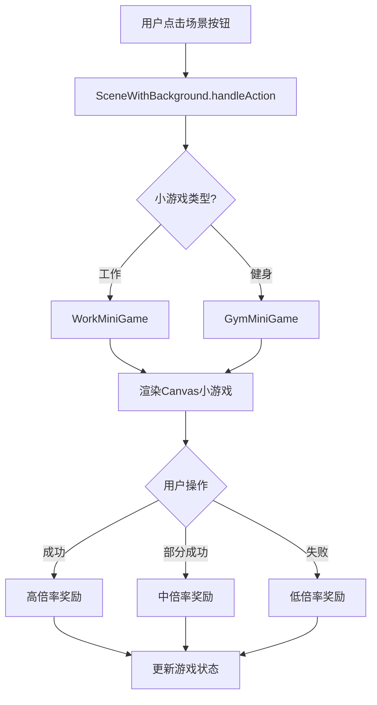
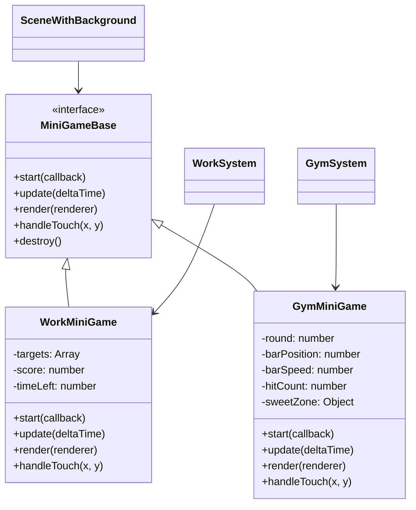

## 用户需求分析

### 问题描述

1. **Bug修复**：从银行、医院、工作、健身房等场景切换到地图时，原有场景的按钮在过渡动画期间仍然显示，残留时间过长，影响用户体验。

### 根本原因（已验证）

- `sceneManager.switchTo()` 调用 `uiManager.clearAll()` 清除按钮后，`onEnter()` 通过 `setTimeout` 异步执行
- 在 `onEnter()` 完成前，`sceneReadyState[newScene]` 为 `false`
- `sceneManager.render()` 中当新场景未就绪时，会**回退渲染旧场景**（第175-176行）
- 旧场景的 `render()` 调用 `uiManager.clear()`（仅清 pendingButtons），然后重新注册所有旧按钮
- 导致过渡动画期间用户仍能看到并点击旧场景的按钮

**次要问题**：`InteractiveAreaManager.renderArea()` 同时向 UIManager 注册 hitArea 和 labelArea 两个透明按钮，存在双重注册。

### 新功能需求

2. **工作场景小互动**：用户点击"上班"或"加班"后，触发一个专注挑战小游戏，需达成目标才能获得全额薪水。
3. **健身房场景小互动**：用户点击"开始锻炼"确认后，触发一个节奏锻炼小游戏，需达成目标才能获得全额锻炼效果。

### 功能边界

- 小游戏为 Canvas 原生渲染，不引入外部游戏引擎
- 小游戏结果影响奖励比例，不影响其他游戏逻辑
- 保持与现有 Ghibli 视觉风格一致

## 技术实现方案

### 一、Bug修复方案（采用方案1）

**修改文件**：`d:/1project_youlonggame/youlong/js/core/sceneManager.js`

**修改点**：`render()` 方法（第169-184行）

**具体修改**：

```javascript
render(renderer) {
    const scene = this.scenes[this.currentScene]
    const isReady = this.sceneReadyState[this.currentScene]
    
    if (isReady && scene) {
        scene.render(renderer)
    } else if (this.isSwitching) {
        // 切换中：不清屏，显示过渡动画即可
        // 不再回退渲染旧场景，防止旧按钮重新注册
    } else if (this.previousScene && this.scenes[this.previousScene]) {
        this.scenes[this.previousScene].render(renderer)
    } else {
        renderer.clear('#16213e')
    }
    
    if (this.transition) {
        this.transition.render(renderer)
    }
}
```

**效果**：切换场景时，旧场景按钮不会被重新注册，过渡动画干净利落。

### 二、InteractiveAreaManager 双重注册修复

**修改文件**：`d:/1project_youlonggame/youlong/js/components/InteractiveAreaManager.js`

**修改点**：`renderArea()` 方法第358-372行

**具体修改**：移除向 UIManager 注册按钮的代码（第358-372行），保留视觉渲染部分。因为 `SceneWithBackground.handleTouchStart()` 并未调用 `areaManager.handleTouchStart()`，触摸处理实际由 UIManager 的按钮系统独立完成，双重注册会导致单次点击触发两次回调。

### 三、工作小游戏设计

**新增文件**：`d:/1project_youlonggame/youlong/js/miniGames/WorkMiniGame.js`

**游戏规则**：

- 触发时机：用户点击"上班"或"加班"后、薪资计算前
- 玩法：Canvas 上随机位置出现蓝色目标圆圈，用户需在5秒内点击尽可能多的目标
- 目标总数：8个，每个目标出现后1.5秒消失
- 判定阈值：
- 点击 ≥ 6 个：完美（100% 薪资）
- 点击 3-5 个：良好（60% 薪资）
- 点击 < 3 个：失败（30% 薪资）
- 渲染元素：目标圆圈（带缩放动画）、倒计时进度条、已点击计数、提示文字
- 触摸处理：重写 `handleTouch(x, y)` 方法，检测是否点击到活跃目标

**类接口设计**：

```javascript
class WorkMiniGame {
    constructor(game)
    start(callback)      // callback(result: {success, score, salaryMultiplier})
    update(deltaTime)
    render(renderer)
    handleTouch(x, y)
    destroy()
}
```

### 四、健身小游戏设计

**新增文件**：`d:/1project_youlonggame/youlong/js/miniGames/GymMiniGame.js`

**游戏规则**：

- 触发时机：用户点击"开始锻炼"确认后、效果计算前
- 玩法：一个指示条在轨道上来回移动，轨道上有"甜蜜区"（绿色），用户需在指示条经过甜蜜区时点击"发力"
- 回合：5轮，每轮指示条速度递增（1.0 → 1.8）
- 甜蜜区宽度：初始80px，每轮递减8px
- 判定阈值：
- 完美（≥ 4轮命中）：100% 效果
- 良好（2-3轮命中）：80% 效果
- 失败（< 2轮命中）：30% 效果
- 渲染元素：轨道背景、甜蜜区高亮、指示条（带拖尾效果）、回合指示器、提示文字
- 触摸处理：监听全局触摸，判定点击时指示条是否在甜蜜区内

**类接口设计**：

```javascript
class GymMiniGame {
    constructor(game)
    start(callback)      // callback(result: {success, hitCount, effectMultiplier})
    update(deltaTime)
    render(renderer)
    handleTouch(x, y)
    destroy()
}
```

### 五、系统集成方案

**修改 WorkSystem.js**：

- `showWorkModal()` 中，点击"上班"/"加班"按钮后，不直接调用 `doWork()`
- 改为先调用 `sceneWithBackground.startMiniGame('work', isOvertime, callback)`
- 小游戏完成后，根据 `salaryMultiplier` 调整实际获得的薪资
- 再调用 `doWork()` 或直接计算薪资并更新状态

**修改 GymSystem.js**：

- `showGymModal()` 中，点击"健身"确认后，不直接调用 `doExercise()`
- 改为先调用 `sceneWithBackground.startMiniGame('gym', callback)`
- 小游戏完成后，根据 `effectMultiplier` 调整实际恢复量
- 再调用 `doExercise()` 或直接计算效果并更新状态

**修改 SceneWithBackground.js**：

- 新增 `currentMiniGame` 属性（null | WorkMiniGame | GymMiniGame）
- 新增 `startMiniGame(type, ...args)` 方法：创建对应小游戏实例，启动游戏循环
- 修改 `render()`：当 `currentMiniGame` 存在时，优先渲染小游戏
- 修改 `handleTouchStart(x, y)`：当小游戏活跃时，将触摸事件转发给小游戏
- 小游戏结束后回调：清除 `currentMiniGame`，执行原回调

**修改 gameConfig.js**：

- 新增 `miniGame` 配置节：

```javascript
miniGame: {
    work: {
        duration: 5,           // 游戏时长（秒）
        totalTargets: 8,        // 目标总数
        targetLifetime: 1.5,   // 每个目标存在时间（秒）
        perfectThreshold: 6,    // 完美阈值
        goodThreshold: 3,       // 良好阈值
        perfectMultiplier: 1.0, // 完美奖励倍数
        goodMultiplier: 0.6,    // 良好奖励倍数
        failMultiplier: 0.3     // 失败奖励倍数
    },
    gym: {
        rounds: 5,             // 回合数量
        baseSpeed: 1.0,        // 基础速度
        speedIncrement: 0.2,    // 每轮速度增量
        baseSweetZoneWidth: 80,  // 基础甜蜜区宽度（px）
        sweetZoneShrink: 8,     // 每轮甜蜜区缩减（px）
        perfectThreshold: 4,    // 完美阈值（命中次数）
        goodThreshold: 2,       // 良好阈值
        perfectMultiplier: 1.0, // 完美效果倍数
        goodMultiplier: 0.8,   // 良好效果倍数
        failMultiplier: 0.3     // 失败效果倍数
    }
}
```

### 六、架构设计

**系统架构图**：



**类结构**：



### 七、性能考虑

- 小游戏使用 Canvas 原生渲染，无额外 DOM 开销
- 目标对象池化复用，避免频繁 GC
- 触摸检测使用简单矩形/圆形碰撞，O(n) 复杂度
- 小游戏结束后立即销毁实例，释放内存
- 与现有渲染循环集成，不引入额外 requestAnimationFrame

### 八、文件变更清单

**修改文件**：

1. `js/core/sceneManager.js` - 修复 render() 方法（~5行修改）
2. `js/components/InteractiveAreaManager.js` - 移除双重注册代码（~15行删除）
3. `js/systems/WorkSystem.js` - 集成工作小游戏（~30行修改）
4. `js/systems/GymSystem.js` - 集成健身小游戏（~25行修改）
5. `js/scenes/sceneWithBackground.js` - 支持小游戏渲染和触摸（~40行新增/修改）
6. `js/data/gameConfig.js` - 添加小游戏配置（~25行新增）

**新增文件**：

1. `js/miniGames/WorkMiniGame.js` - 工作小游戏类（~150行）
2. `js/miniGames/GymMiniGame.js` - 健身小游戏类（~180行）

## 小游戏UI设计方案

### 工作小游戏 - "专注挑战"

**视觉风格**：与游戏整体 Ghibli 风格一致，使用温暖色调

**布局设计**（从上到下）：

1. **顶部提示区**（y=20-60）：显示"专注挑战！"标题，字号18px，颜色 #5D4037
2. **倒计时进度条**（y=70-85）：宽度80%，居中，高度15px，圆角，背景 #E0E0E0，填充色根据剩余时间从 #FFE080 渐变到 #E57373
3. **分数显示**（y=95-120）："已点击 X/8"，字号16px，颜色 #5D4037
4. **游戏区域**（y=130 到屏幕下方100px）：目标圆圈随机出现区域
5. **底部提示**（y=屏幕高度-80）："快速点击出现的蓝色圆圈！"，字号12px，颜色 #7B8794

**目标圆圈设计**：

- 正常状态：蓝色实心圆 #4A90D9，半径20px，带轻微缩放脉冲动画（1.0→1.1→1.0，周期0.5秒）
- 点击后：放大消失动画（0.2秒内半径 20→40，透明度 1→0）
- 消失时：播放金色粒子爆发效果（6-8个小球向四周扩散）

### 健身小游戏 - "节奏锻炼"

**视觉风格**：动感、活力，使用绿色系代表健康

**布局设计**（从上到下）：

1. **顶部提示区**（y=20-60）：显示"节奏锻炼！"标题，字号18px，颜色 #5D4037
2. **回合指示器**（y=70-95）：5个圆点，当前回合高亮 #81C784，已过回合 #C8E6C9，未过回合 #E0E0E0
3. **游戏轨道区**（y=120-220）：

- 轨道背景：圆角矩形，#F5F5F5，高度30px，宽度80%居中
- 甜蜜区：轨道上的绿色区域 #81C784，圆角，带呼吸动画（透明度 0.7→1.0）
- 指示条：红色圆形 #E57373，半径12px，带白色拖尾效果（3个逐渐消失的小圆）

4. **操作按钮区**（y=240-300）："发力！"按钮，Ghibli风格，#FFE080背景，点击时有缩放反馈
5. **分数/提示区**（y=屏幕高度-80）：显示"已命中 X/5 次"，字号14px

**动画效果**：

- 指示条移动：匀速来回，碰壁反弹
- 甜蜜区呼吸：透明度周期性变化，吸引用户注意
- 命中成功：甜蜜区闪烁绿色，显示"+1"飘字动画
- 命中失败：按钮震动效果（位置微调模拟）

## 使用的 Agent 扩展

### SubAgent

- **code-explorer**
- 用途：探索代码库，定位场景切换按钮残留问题的根本原因，分析工作/健身系统现有实现
- 预期结果：已获得完整的代码结构和问题定位，为方案设计提供依据